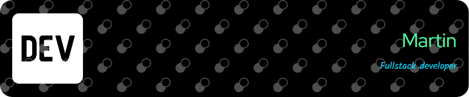

## Bienvenid@ al GitHub de Martin 👋

Hola, soy Martín, estudiante de 'Tecnicatura Superior en Análisis de Sistemas' en el Instituto Juan XXIII de Bahía Blanca. Apasionado por la tecnología y el desarrollo de software , siempre estoy dispuesto a aprender y explorar nuevas tecnologías para seguir creciendo profesionalmente.

      
	
<!--  -->
<!--  -->
<!--  -->
<!--  -->
<!--  -->

### 
<b>Estadisticas</b>

